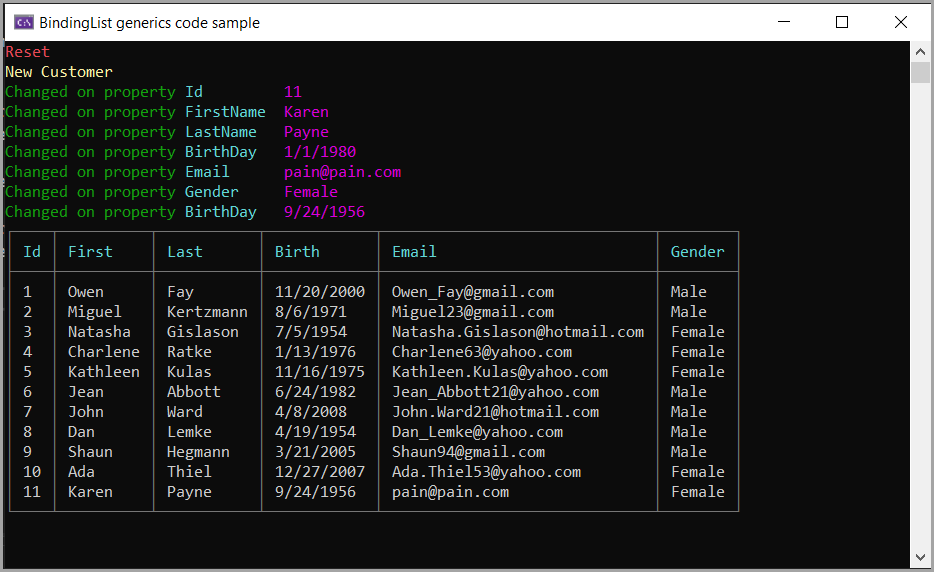

# About

Code sample to 

- Read and write BindingList&lt;T> to and from a json file.
- Add range to a BindingList&lt;T> with RaiseListChangedEvents set to false so not to trigger ListChanged event.

## Data

Data is generated with NuGet package Bogus.

## Screenshot

- Top section shows changes to the BindingList after load
    - Reset on clear of the BindingList
    - New customer is when a new customer is add to the BindingList
    - Changed, when a property has changed to a custom in the BindingList
- Bottom table shows current customer list in the BindingList

